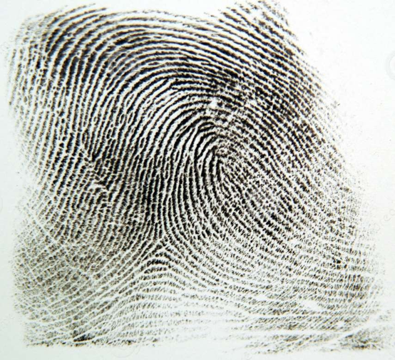
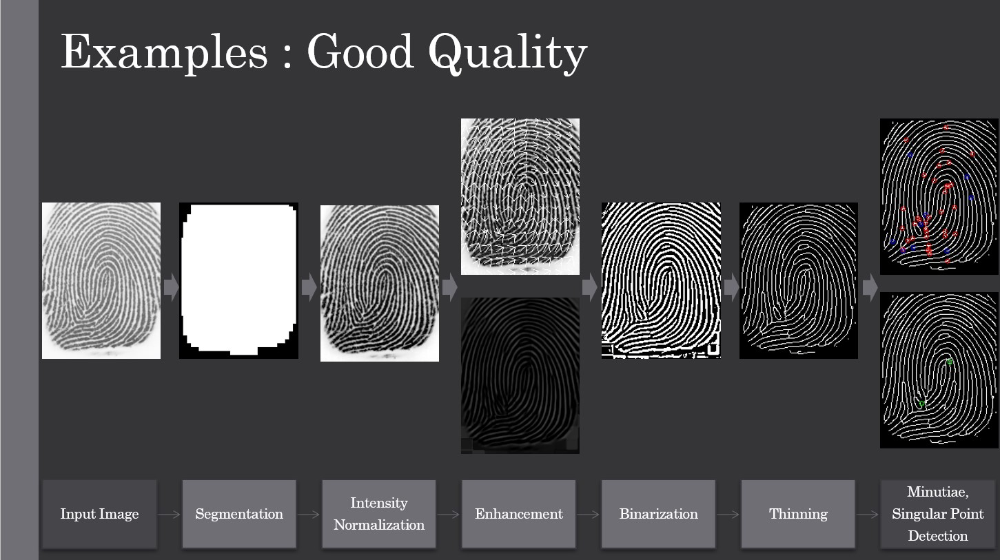

## OpenCV를 활용한 지문인식 프로젝트

#### 지문 유형 분포
  - 아래 표는 왼쪽 루프 유형이 팀 주변의 모든 손가락 중 대다수 (35 %)에서 나타나는 것을 보여줍니다. 다음 유형은 Whorl (27.5 %)입니다. 또한 Arch와 Tentarch는 우리 팀에 존재하지 않습니다. 결론적으로 루프 (오른쪽 루프, 왼쪽 루프, 이중 루프, 오른쪽 포켓 루프, 왼쪽 포켓 루프)가 지배적 인 유형입니다.


##### 능선 간격
- 우리는 한 쌍의 세부 사항을 발견하고 둘 사이의 거리를 측정했습니다. 결론적으로 우리는 대부분의 손가락 융기 간격이 1.8 < x <2.2 범위에 있음을 발견했습니다.
> 능선 간격이 손가락 유형과 무관하다는 것을 발견했습니다.


특이점 수 (평균)
코어 : 1.34 델타 : 0.47
일반적으로 코어는 델타 이상이라는 것을 알았습니다.

특징 수 (평균)
끝 : 16.375 분기 : 24.97
예기치 않게 분기 수가 끝보다 많다는 결과가 있습니다.

 


#### 지문 인식 알고리즘의 성능에 영향을 미칠 수있는 요인

> 피부 습도, 피부 스크래치, 각 손가락의 면적 / 크기 : 특히 링 / 핑키 핑거는 다른 것보다 작습니다. 그래서 깨끗한 이미지를 얻기가 더 어렵습니다. 압력에 따른 흐릿한 이미지, 압력 방향에 따라 다른 영역, 피부에 묻은 것 (예 : 먼지, 기름 ..)
 

### 시스템 흐름도


#### Segmentation & normalization

```cpp
	//      Segmentation      //
	Mat meanMask, varianceMask;
	Segmentation(mat, 5, 5, 230, meanMask, varianceMask);   //block size is 5
	Mat mask = meanMask & varianceMask;
	dilate(mask, mask, Mat(), Point(-1, -1), 3, 0, BORDER_CONSTANT);
	erode(mask, mask, Mat(), Point(-1, -1), 3, 0, BORDER_CONSTANT);
	imshow("mask", mask);

	//      Intensity Normalize      //
	equalizeHist(mat, mat);
	imshow("EqualizeHistogram", mat);
	mat.convertTo(mat, CV_32F, 1.0 / 255, 0);   //type : uchar -> float / scale 0~1
	Normalize(mat);
	imshow("Normalize", mat);
```

#### Segmentation

```cpp
void Segmentation(Mat input, int blockSize
	, int blackT, int whiteT, Mat& meanMask, Mat& varMask) {
	Mat origin = input.clone();

	int sg_blockSize = blockSize;   //segment blocksize

	Mat sg_m, sg_v;  //Mean mask , Variance mask

				 //zero-padding
	copyMakeBorder(origin, sg_m, 0, sg_blockSize, 0, sg_blockSize, BORDER_CONSTANT, 0);
	copyMakeBorder(origin, sg_v, 0, sg_blockSize, 0, sg_blockSize, BORDER_CONSTANT, 0);

	Mat segmented_m, segmented_v;

	// Mask
	for (int img_x = 0; img_x < origin.cols; img_x += sg_blockSize) {
		for (int img_y = 0; img_y < origin.rows; img_y += sg_blockSize) {
			Mat sg_block = sg_m(Rect(img_x, img_y, sg_blockSize, sg_blockSize));

			//calculate mean
			int pixelCount = 0;
			int sg_mean = 0;
			for (int x = 0; (x < sg_blockSize) && (img_y + x < origin.rows); x++) {
				for (int y = 0; (y < sg_blockSize) && (img_x + y < origin.cols); y++) {
					sg_mean += (int)sg_m.at<uchar>(img_y + x, img_x + y);
					pixelCount++;
				}
			}
			sg_mean = sg_mean / pixelCount;

			//calculate variance
			int sg_variance = 0;
			int sg_dev = 0;
			for (int x = 0; (x < sg_blockSize) && (img_y + x < origin.rows); x++) {
				for (int y = 0; (y < sg_blockSize) && (img_x + y < origin.cols); y++) {
					sg_dev = (int)sg_m.at<uchar>(img_y + x, img_x + y);
					sg_dev -= sg_mean;
					sg_variance += sg_dev * sg_dev;
					pixelCount++;
				}
			}
			sg_variance = sg_variance / pixelCount;

			//Mean fill in Matrix
			//black (0)
			if (sg_mean > whiteT /*|| sg_mean < blackT*/)
			{
				for (int x = 0; (x < sg_blockSize) && (img_y + x < origin.rows); x++) {
					for (int y = 0; (y < sg_blockSize) && (img_x + y < origin.cols); y++) {
						sg_m.at<uchar>(img_y + x, img_x + y) = 0;
						//sg_v.at<uchar>(img_y + x, img_x + y) = 0;
					}
				}
			}
			//white (255)
			else {
				for (int x = 0; (x < sg_blockSize) && (img_y + x < origin.rows); x++) {
					for (int y = 0; (y < sg_blockSize) && (img_x + y < origin.cols); y++) {
						sg_m.at<uchar>(img_y + x, img_x + y) = 255;
						//sg_v.at<uchar>(img_y + x, img_x + y) = 255;
					}
				}
			}

			//variance fill in image
			//black (0)
			if (/*sg_variance > whiteT ||*/ sg_variance < blackT)
			{
				for (int x = 0; (x < sg_blockSize) && (img_y + x < origin.rows); x++) {
					for (int y = 0; (y < sg_blockSize) && (img_x + y < origin.cols); y++) {
						sg_v.at<uchar>(img_y + x, img_x + y) = 0;
					}
				}
			}
			//white (255)
			else {
				for (int x = 0; (x < sg_blockSize) && (img_y + x < origin.rows); x++) {
					for (int y = 0; (y < sg_blockSize) && (img_x + y < origin.cols); y++) {
						sg_v.at<uchar>(img_y + x, img_x + y) = 255;
					}
				}
			}

		}
		segmented_m = sg_m(Rect(0, 0, origin.cols, origin.rows)); // Mean mask
		segmented_v = sg_v(Rect(0, 0, origin.cols, origin.rows)); // Variance mask

		meanMask = segmented_m;
		varMask = segmented_v;
	}
}
```


이 방법을 사용했을 때 깨진 부분이 잘 복원되지 않았습니다. 그래서 filter2D를 구현할 때마다 입력 이미지를 변경하고 더 부드럽고 더 잘 연결되도록하는 방법을 생각했습니다.


### Gabor filter
```cpp
// gabor filter parameter 
	double sig = 9, lm = 7.2, gm = 0.02, ps = 0;
	double theta;
	float ffi;

	/////Gabor filtering
	for (int m = special; m < temp.rows - special; m++) {
		for (int n = special; n < temp.cols - special; n++) {
			theta = stemp.at<float>(m, n);
			kernel3 = getGaborKernel(Size(kernel_size, kernel_size), sig, theta, lm, gm, ps, CV_32F);
			ffi = 0;
			for (int k = 0; k < kernel_size; k++) {
				for (int l = 0; l < kernel_size; l++) {
					ffi += temp.at<float>(m - special + k, n - special + l)*kernel3.at<float>(kernel_size - 1 - k, kernel_size - 1 - l);
				}
			}
			forgab.at<float>(m, n) = ffi / (kernel_size * kernel_size);
		}
	}
```

filter2D를 사용하기 위해 해당 부분의 theta 값을 이용하여 관심 영역을 걸러 냈는데 픽셀 수가 줄어들고 외삽이 부 자연스러운 부분이라는 문제가있었습니다. 위와 같은 문제를 해결했습니다.


모든 픽셀이 테스트되고 다음 조건을 모두 충족하는 픽셀 (동시에)이이 단계에서 기록됩니다.
(0) 픽셀은 검은 색이고 8 개의 이웃이 있습니다.
(1) 2 <= B (P1) <= 6
(2) A (P1) = 1
(3) P2 및 P4 및 P6 중 적어도 하나는 흰색입니다.
(4) P4 및 P6 및 P8 중 적어도 하나는 흰색입니다.
이미지를 반복하고 모든 단계 1 조건을 충족하는 모든 픽셀을 수집 한 후 이러한 모든 조건을 충족하는 픽셀은 흰색으로 설정됩니다.

2 단계
모든 픽셀이 다시 테스트되고 다음 조건을 모두 충족하는 픽셀이이 단계에서 확인됩니다.
(0) 픽셀은 검은 색이고 8 개의 이웃이 있습니다.
(1) 2 <= B (P1) <= 6
(2) A (P1) = 1
(3) P2 및 P4 및 P8 중 하나 이상이 흰색 임
(4) P2, P6, P8 중 하나 이상이 흰색 임
이미지를 반복하고 모든 2 단계 조건을 충족하는 모든 픽셀을 수집 한 후 이러한 모든 조건을 충족하는 픽셀은 다시 흰색으로 설정됩니다.

되풀이
1 단계 또는 2 단계의 이번 라운드에서 픽셀이 설정된 경우 이미지 픽셀이 변경되지 않을 때까지 모든 단계가 반복됩니다.


지문에는 다양한 특징점이 있습니다.

그래서 우리는 Ending, Bifurcation을 감지해야합니다.

두 가지 요소에 집중했습니다.


오리엔테이션 맵에서 추출한 값으로 단일 지점을 감지했습니다.
위와 같은 이론을 사용하여 아래와 같은 알고리즘을 구성했습니다.

### Singular Point detection
```cpp
void singularpoint(const Mat &inputImage, Mat &orien, Mat &core, Mat &delta)
{
	Mat cmasked = inputImage.clone();
	cmasked.convertTo(cmasked, CV_32F);//convert type for using orientation function 
	orientation(cmasked, orien, 9);//block size is 9

	Mat sp;
	sp = orien.clone();
	//Normalize orientation field 0~7 value 
	for (int i = 0; i < sp.rows; i++) {
		for (int j = 0; j < sp.cols; j++) {
			if (sp.at<float>(i, j) < (CV_PI*0.125)) sp.at<float>(i, j) = 0;
			else if (sp.at<float>(i, j) < (CV_PI*0.25)) sp.at<float>(i, j) = 1;
			else if (sp.at<float>(i, j) < (CV_PI*0.375)) sp.at<float>(i, j) = 2;
			else if (sp.at<float>(i, j) < (CV_PI*0.5)) sp.at<float>(i, j) = 3;
			else if (sp.at<float>(i, j) < (CV_PI*0.625)) sp.at<float>(i, j) = 4;
			else if (sp.at<float>(i, j) < (CV_PI*0.75)) sp.at<float>(i, j) = 5;
			else if (sp.at<float>(i, j) < (CV_PI*0.875)) sp.at<float>(i, j) = 6;
			else sp.at<float>(i, j) = 7;
		}
	}
	int a[9];
	int va;
	int sub;
	//core & delta Map
	core = Mat::zeros(sp.size(), sp.type());
	delta = Mat::zeros(sp.size(), sp.type());
	for (int i = 1; i < sp.rows - 1; i++) {
		for (int j = 1; j < sp.cols - 1; j++) {
			va = 0;
			a[0] = sp.at<float>(i - 1, j - 1);
			a[1] = sp.at<float>(i - 1, j);
			a[2] = sp.at<float>(i - 1, j + 1);
			a[3] = sp.at<float>(i, j + 1);
			a[4] = sp.at<float>(i + 1, j + 1);
			a[5] = sp.at<float>(i + 1, j);
			a[6] = sp.at<float>(i + 1, j - 1);
			a[7] = sp.at<float>(i, j - 1);
			a[8] = a[0];
			for (int k = 0; k < 7; k++) {
				sub = a[k] - a[k + 1];
				if (sub == -7) sub = 1;
				if (sub == 7) sub = -1;
				va += sub;
			}
			//calculate gradient gap
			if (va == -8) core.at<float>(i, j) = 1;
			if (va == 8) delta.at<float>(i, j) = 1;
		}
	}
}
```

##### Process




