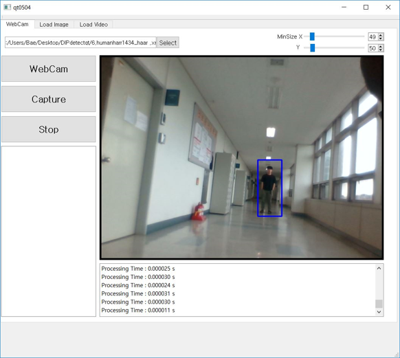

---

layout: post

title:  "Face, Human, Car Detection with OpenCV"

author: HSH

categories: [ Project ]

tags: [ Image Processing, OpenCV, detecting, face detect,Digital Image ]

image: assets/images/face_detect.gif

---

 >컴퓨터 비전 분야에 있어서 특징을 추출하여 분석하는 일은 매우 중요하다. 특징점을 추출하는 방법 중 하나인 Haar like Feature는 object recognition 분야에서 digital image feature이다. 이는 Haar wavelets 이라고도 불리며, real-time 기반의 face detector 라고 할 수 있다. 2001년 두 학자(Viola, Jones)가 "Rapid Object Detection using a Boosted Cascade of Simple Features"에서 제안한 방법이다. 

*GUI 프로그램 개발에 QT를 Visual Studio와 연동하여 Window 응용 프로그램을 제작하였다.*

##시연 영상

###face

　　

　　

　　

##사진
###human

　　

　　

　　

###car

　　

　　

　　
