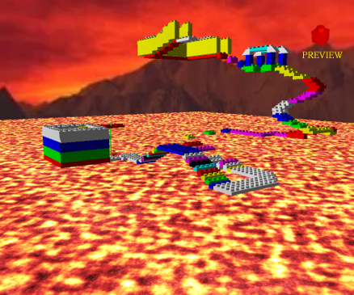
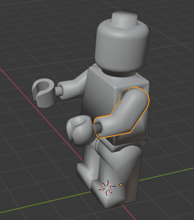
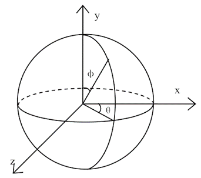

<iframe width="760" height="515" src="https://www.youtube.com/embed/F36fDCA7pTE" frameborder="0" allow="accelerometer; autoplay; encrypted-media; gyroscope; picture-in-picture" allowfullscreen></iframe>

### [Source Code 보러가기](https://github.com/hsh0321/OpenGL-Lego-Game)

　Visual Studio IDE를 이용하고 Opengl 오픈 그래픽 라이브러리를 이용하여 실습하였다. 이 API는 약 250여개 가량의 함수 호출	을 이용하여 단순한 기하도형에서부터 복잡한 삼차원 장면을 생성할 수 있다. OpenGL은 현재 CAD, 가상현실, 정보시각화, 비행 시뮬레이션 등의 분야에서 활용되고 있다. 또한 컴퓨터 게임 분야에서도 널리 활용되고 있으며, 마이크로소프트사의 Direct3D와 함께 컴퓨터 그래픽 세계를 양분하고 있다.

　프로젝트의 주제는 다음과 같다. "레고를 활용하여 게임을 만들기". 참으로 제한적인 주제이면서 창의성을 요구하는 주제였다. 제작년에도 선배들이 이 주제를 가지고 프로젝트를 한 사례가 있었고 레고로 자동차 만들기, 레고 놀이동산 만들기 등 개인적으로 누구나 생각할 수 있는 주제들이였다. 본인은 이런 한정적인 주제가 별로 마음에 들지 않았지만 창의적인 아이디어를 내기 위해 노력하였다. 내가 생각한 주제는 레고로 탈출 맵을 생성하고 레고 캐릭터가 그위를 이동하면서 탈출하는 주제이다. 일단 서론은 여기까지 하고 전반적인 흐름을 보여주겠다.



　위의 그림은 원문의 초기에 영상에서 확인 할 수 있듯이 플레이 중의 한 장면이다. 공중에 펼쳐져 있는 레고들이 탈출을 위한 map이고 이것또한 플레이어가 직접 구성한다. 아래의 용암이 차오르기 시작하면 플레이어는 특정 Start Point에서 시작하여 무작정 살기 위하여 위로 올라가는 것이 플레이의 목적이다.



　	레고 Obj파일은 [Tincercad](https://www.tinkercad.com/things/ceqcEF3nfDJ) 에서 무료로 제공하는 파일을 가져다 사용하였다. 기본적인 레고의 도형같은 경우는 Blender를 이용하여 제작하였고 이 과목을 수강하면서 처음 접해본 모델링 프로그램이였는데 매우 전문적인 지식이 필요한 Tool 이였다.

 마우스를 이용한 확대/축소 및 회전을 구현하기 위해 수학적인 요소도 필수 불가결하였다. 아래는 마우스를 이용한 카메라의 이동 소스 코드의 일부분이다. Obj 파일을 C++에서 불러오기 위하여 Raw한 data를 위의 Source와 같이 점,선,면 등 data로 추출한 좌표들을 기본 함수들을 응용하여 렌더링 할 수 있도록 하였다. ObjParsing 하는 Source code는 Github에도 많이 배포되어 있어 설명과 코드는 생략한다.

　프로젝트를 진행하면서 가장 어려웠던 부분은 object와 camera의 이동이였다. (Unity를 사용해보고 이렇게 하드코딩 한 것이 매우 편한 기능으로 주어진 것이 놀라웠다.)




#### Camera

```cpp
int upY = 1;
double phi = 45;
double theta = 45;
int r = 40;
double eyeX = r * sin(deg2rad(theta))*sin(deg2rad(phi));
double eyeY = r * cos(deg2rad(theta));
double eyeZ = r * sin(deg2rad(theta))*cos(deg2rad(phi));
double mX=0, mY=0,mZ = 0;

```

#### Camera

```cpp
void motion(int x, int y) {
	if (drag == 1) { // 좌클릭 Press 상태
		if (gamemode == 0) {
			if (x > tempX) {
				phi = phi + 1;
				if (phi >= 355) {
					phi = 0;
				}
			}
			else if (x < tempX) {
				phi = phi - 1;
				if (phi <= 0) {
					phi = 360;
				}
			}
			if (y > tempY) {
				if (theta < 88)theta = theta + 1;
				if (fmod(theta, 180) == 0.5) { //  지형 밑으로 시점 못내려감.
					upY = -1;
				}
				if (theta >= 360) {
					theta = 5; upY = 1;
				}
			}
			else if (y < tempY) {
				if (theta > 1)theta = theta - 1;
				if (fmod(theta, 180) == 0) {
					upY = 1;
				}
				if (theta <= 0) {
					theta = 360; upY = -1;
				}
			}
			tempX = x;	tempY = y;
		}        
        .....
	}

	eyeX = r * sin(deg2rad(theta))*sin(deg2rad(phi));
	eyeY = r * cos(deg2rad(theta));
	eyeZ = r * sin(deg2rad(theta))*cos(deg2rad(phi));

	.....
	glutPostRedisplay();
}

```


 또한 GLUT는 반복적인 처리가 필요할 때 주로 사용되는 타이머 이벤트도 제공한다.

void glutTimerFunc(unsigned int millis, void (*func)(int value), int value); 
msec 후에 func함수를 호출하며 인수로 value를 전달한다. value는 타이머 콜백으로 전달되어 작업거리를 지시하는데 타이머의 용도가 하나뿐이라면 아무값이나 주어도 상관은 없다. 콜백을 등록해 놓으면 millis 후에 콜백함수가 호출된다. 일반적인 타이머와는 다르게 주기적으로 호출되는게 아니라 딱 한번만 호출된다. 주기적으로 계속 호출하려면 콜백함수에서 자신을 계속 호출해야한다. 불편하긴 하지만, 호출될때마다 다음 주기를 가변적으로 설정할 수 있다는 점에서 활용성은 더 높다.

 +)애니메이션을 할 때에는 더블버퍼링을 사용하는게 좋다.
버퍼 한개에서 지웠다 그렸다를 반복하면 깜빡임 현상이 발생하기 때문이다.


```cpp

void gravity_idle(void) { // 중력
	if (gamemode == 1) {
		if (lego_char.locate.y > 0 && crashLegochar() == false) {
			lego_char.locate.y -= 0.20;
			if (crashLegochar() == true) {
				lego_char.locate.y += 0.20;
				jy = 0;
			}
			//bjump = false;
		}
		else {
			jy = 0;
		}
		if (lego_char.locate.y < lavaHeight) {
			jy = 0;
			lego_char.locate = { 0,15,0 };
			lavaHeight = 0;
		}
	}
}

void walk_idle(void) { // 걷는데 이동
	if (walk == true) {
		lego_char.locate.x += wspeed * sin(deg2rad(lego_char.angle.y));
		lego_char.locate.z += wspeed * cos(deg2rad(lego_char.angle.y));
		if (crashLegochar() == true) {
			lego_char.locate.x -= wspeed * sin(deg2rad(lego_char.angle.y));
			lego_char.locate.z -= wspeed * cos(deg2rad(lego_char.angle.y));
		}
	}
}

```

 위와 같이 함수로 구현된 ms마다의 동작을 반복적으로 호출하면서 이미지를 동영상으로 보여주는 방식이다. object들의 인자들의 값을 변화하면서 캐릭터를 이동시키거나 카메라를 이동시키는 듯 게임에서 작용하는 요소들을 구현해주어야한다. +) 게임스러워 보이게 만들기 위하여 이런 함수를 10개 넘게 사용하였다. 팔움직이기,중력,용암올라오기 등...

 처음으로 2000줄이 넘는 소스코드를 작성해봤고 이렇게 길게 작성한것도 처음이여서 프로그램이 가동되는 것에만 집중하여 코드가 매우 지저분하다. 사실상 C언어로 짠 것과 다름없는 절차식 코드라고 해도 무방하다. 나중에는 코드가 너무 길어져서 유지 보수와 오류 찾기에 시간낭비를 엄청 하였는데 이것 또한 교훈이 된 과목이였다.