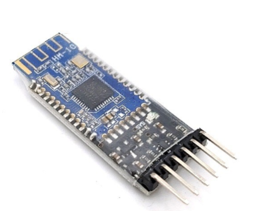
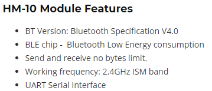
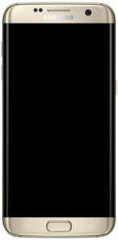
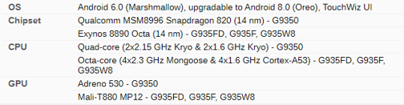
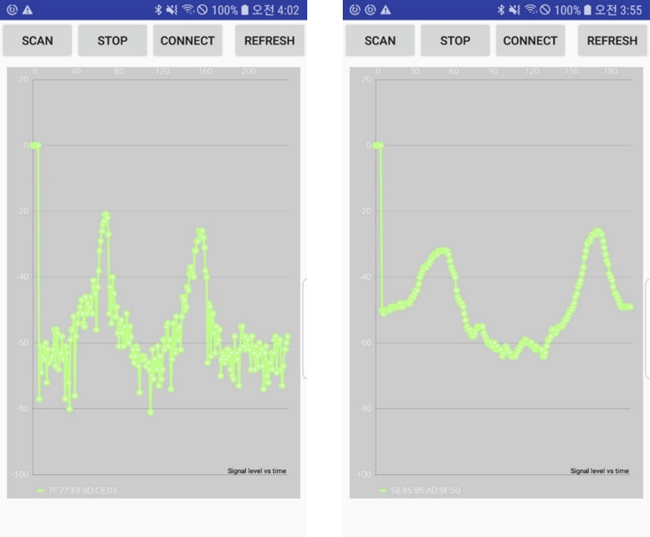
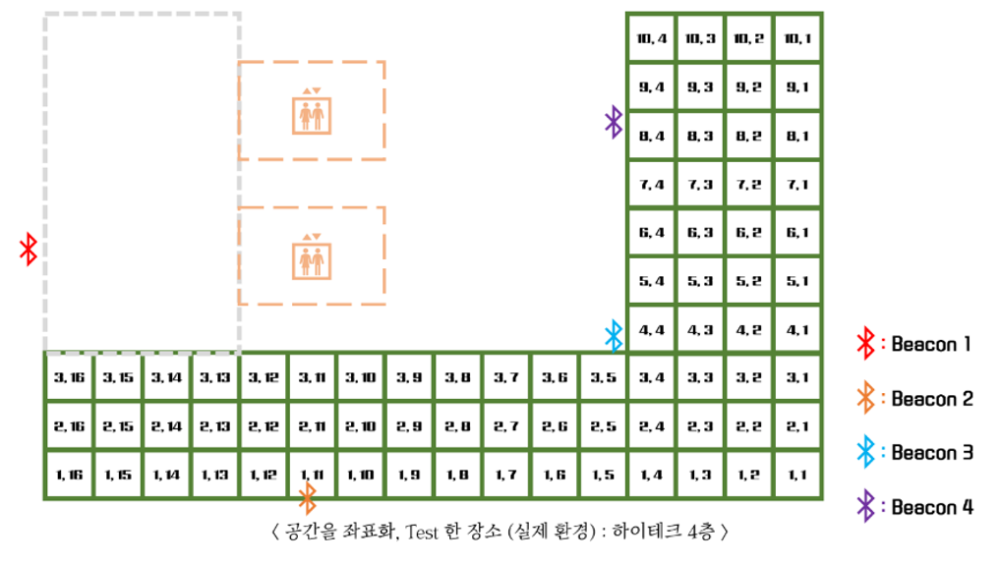

　 최근 소비자들의 편리성을 증대시키기 위하여 실내 위치 측정에 관한 다양한 연구가 진행되고 있다. 단순히 무선 신호에 기반한 측위 시스템에서는 송수신기 사이의 전파 경로가 물체들로 인해 가려지거나, 다른 환경적인 요인들로 인한 신호의 정확성 문제가 발생하기 때문에 무선 신호만을 이용하여 정확한 실내 위치를 도출하는 것에는 한계가 존재한다.** BLE(Bluetooth Low Energy) Beacon**을 이용하여 실내 위치 측위를 하는 방법들은 대부분 정확성이 떨어져서 실제로 사용함에 있어서 한계가 존재한다. 본 연구의 목적은 위에서 발생한 문제점들을 해결하기 위해 Beacon을 설치하여 **신호 강도(Received Signal Strength Indication, RSSI)**를 실시간으로 수신하여 **기계 학습**을 이용하여 실내 위치 측위 오차를 개선하는 것이다. 또한, 최근 들어 증강현실 기술이 비약적으로 발전하면서 사용자들에게 많은 서비스를 제공하고 있음에 따라 **증강현실**을 이용하여 실내에서의 다양한 서비스를 제공하는 응용 소프트웨어를 구현하였다.
	
> 이 프로젝트는 Deep Learning과 BLE Beacon을 사용하여 정확한 실내 위치 측위와 AR Navigation Software를 제작하는 것을 목표로 하였다.

	

  

###### 　 위의 블루투스 모듈은 BLE 비콘을 제작하기 위하여 모듈만 따로 구매하여 제작하였고 아두이노 보드를 사용하여 환경설정 하였다. 그리고 블루투스 신호를 수신하기 위하여 Android 기반의 삼성 갤럭시 스마트폰을 이용하였다.


　 스마트폰에서 수신되는 블루투스의 신호 강도가 얼마나 불규척인지 알아보기 위하여 간단한 스마트폰 앱을 구현하였고, 대중적으로 사용되는 칼만 필터(Kalman filter)를 적용하여 대조해보았다.





　 기존의 Beacon을 이용한 실내 위 치 측위의 성능을 개선하고 증강현실 응용 소프트 웨어를 구현하였다. 머신러닝을 시키기 위해서는 많은 양의 데이터가 필요하다. 따라서, 실험할 환경을 갖추고 약 3만개의 데이터를 수집하였다. Beacon의 특성상 신호가 불안정하기 때문에, 더 정확한 결과 값을 위해서 각각의 신호를 데이터 처리 과정을 통하여 안정화 시킨 후 중복 데이터를 제거한 후의 개수는 약 1만개 정도로 감소하였다.

　 더 정확한 실내 위치를 측정하기 위해서는 몇가지 개선점이 필요하다고 생각된다. 먼저, 데이터의 양은 많을수록 정확도가 상승한다. 따라서 데이터를 처리하였을 때, 각 좌표마다 약 500개씩의 데이터가 있도록 데이터를 수집했어야 한다. 그렇다면 지금의 데이터에 비해 약 5배의 데이터를 학습시킬 수 있으므로 더 정확한 결과 값이 나올 것이다. 또한 더 적합한 기계 학습 구조와 필터를 사용한다면 실생활에 적용하는 것에도 큰 문제가 없을 것으로 보이며, 이러한 부분들을 개선한다면 비용이 저렴하고 설치가 용이한 Beacon을 이용하여, 다양한 실내 위치 서비스를 AR 형식으로 제공하기 때문에 사용자들의 편의성을 극대화할 수 있을 것이다.

#### Source Code

```c
printf("Hello World");
```